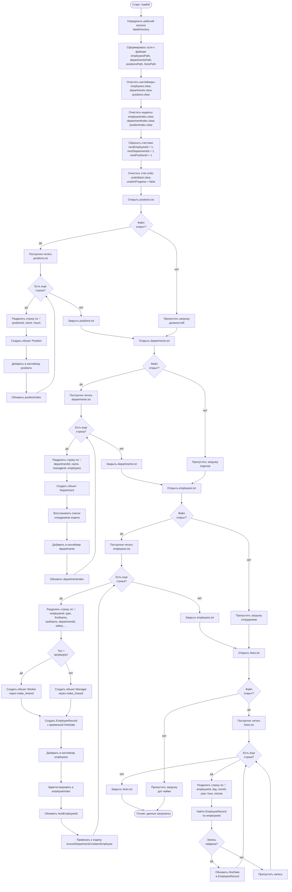
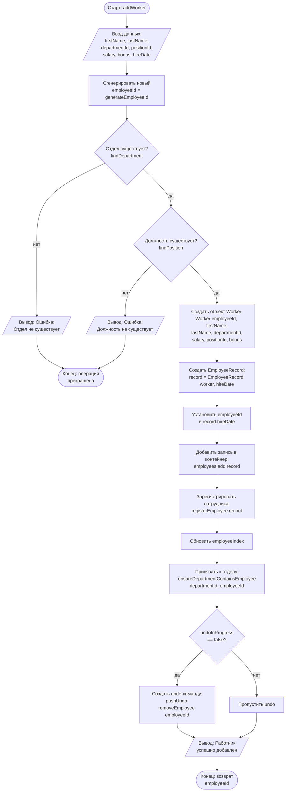
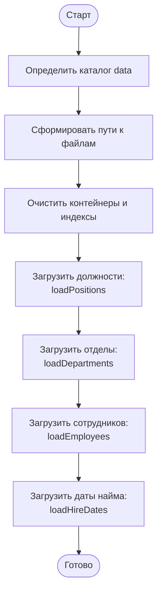
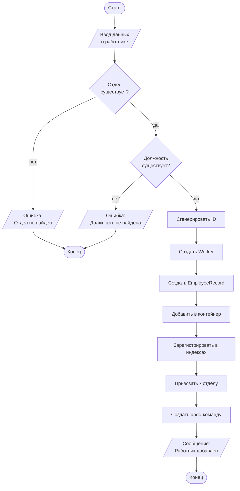

# Блок-схемы алгоритмов

## Руководство по использованию

### Что такое Mermaid?

Mermaid — это язык разметки для создания диаграмм и блок-схем, который поддерживается многими платформами:
- GitHub (автоматически отображает Mermaid диаграммы)
- GitLab
- VS Code (с расширением "Markdown Preview Mermaid Support")
- Онлайн редакторы: https://mermaid.live/

### Как просмотреть блок-схемы

1. **В VS Code:**
   - Установите расширение "Markdown Preview Mermaid Support"
   - Откройте этот файл и нажмите `Ctrl+Shift+V` (или `Cmd+Shift+V` на Mac) для предпросмотра

2. **Онлайн:**
   - Скопируйте код блок-схемы (между ```mermaid и ```)
   - Откройте https://mermaid.live/
   - Вставьте код в редактор
   - Диаграмма отобразится автоматически

3. **В GitHub/GitLab:**
   - Просто загрузите файл в репозиторий
   - Диаграммы отобразятся автоматически при просмотре файла

### Обозначения в блок-схемах

- **Овал** `([текст])` — начало/конец алгоритма
- **Прямоугольник** `[текст]` — процесс/действие
- **Ромб** `{текст}` — условие/проверка
- **Параллелограмм** `[/текст/]` — ввод/вывод данных
- **Стрелки** — направление выполнения алгоритма
  - `-->` — обычная стрелка
  - `-->|да|` — стрелка с меткой "да"
  - `-->|нет|` — стрелка с меткой "нет"

---

## Алгоритм 1. Загрузка данных при старте программы



---

## Алгоритм 2. Добавление нового работника



---

## Альтернативный вариант (упрощенный)

Если предыдущие блок-схемы слишком детализированы, можно использовать упрощенные версии:

### Алгоритм 1. Загрузка данных (упрощенный)



### Алгоритм 2. Добавление работника (упрощенный)



---

## Как экспортировать блок-схемы в изображения

### Способ 1: Mermaid Live Editor
1. Откройте https://mermaid.live/
2. Вставьте код блок-схемы
3. Нажмите "Actions" → "Download PNG" или "Download SVG"

### Способ 2: VS Code
1. Установите расширение "Markdown Preview Mermaid Support"
2. Откройте предпросмотр (Ctrl+Shift+V)
3. Используйте расширение "Markdown PDF" для экспорта в PDF с изображениями

### Способ 3: Командная строка (mermaid-cli)
```bash
npm install -g @mermaid-js/mermaid-cli
mmdc -i flowchart.mmd -o flowchart.png
```

---

## Примечания

- Блок-схемы созданы на основе алгоритмов из файла `algorithm_steps.txt`
- Детализированные версии показывают все шаги алгоритма
- Упрощенные версии показывают основные этапы для лучшей читаемости
- Выберите подходящий вариант в зависимости от требований документации


